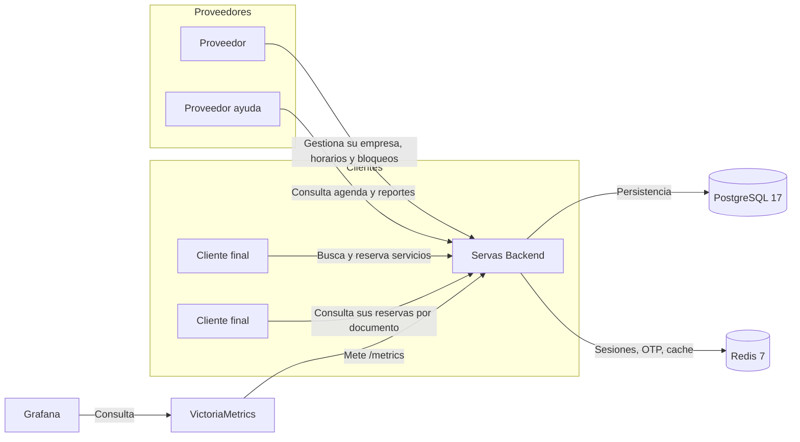
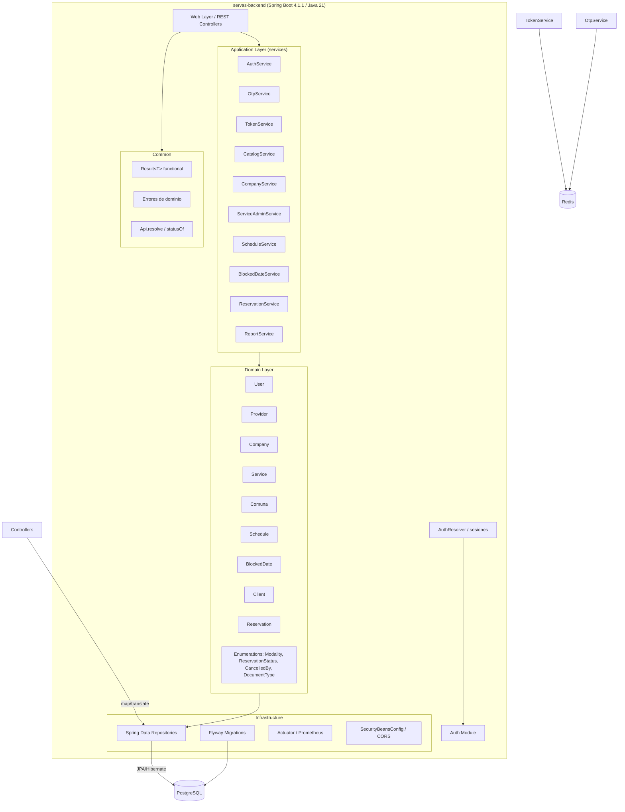
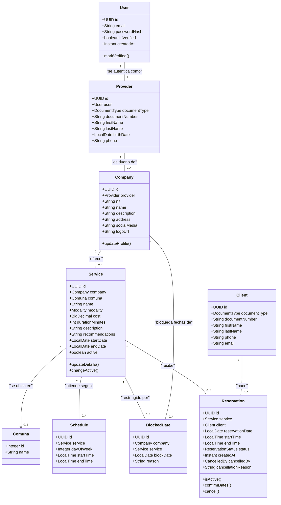
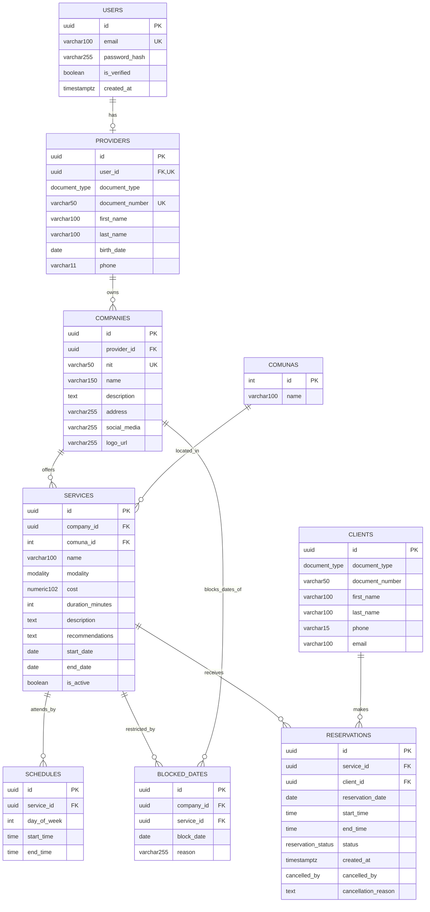

# Arquitectura — Servas Backend

## 1. Diagrama de contexto

## 2. Diagrama de componentes

## 3. Diagrama de dominio

## 4. Diagrama Entidad-Relación (modelo de base de datos)

## 5. Detalle de diseño

### Capas

| Capa            | Paquete                        | Responsabilidad                                            |
|-----------------|--------------------------------|------------------------------------------------------------|
| **Web**         | `com.servas.web`               | Controllers REST, DTOs, resolucion de respuesta `Api`      |
| **Application** | `com.servas.application.*`     | Servicios de caso de uso, logica de negocio                |
| **Domain**      | `com.servas.domain.entity`     | Entidades JPA, enumeraciones                               |
| **Repository**  | `com.servas.domain.repository` | Spring Data Repositories                                   |
| **Config**      | `com.servas.config`            | Beans de seguridad, CORS, criptografia                     |
| **Common**      | `com.servas.common`            | `Result<T>` funcional, errores de dominio, constantes      |
| **Seed**        | `com.servas.seed`              | `DataSeeder` con datos de demo (condicional por propiedad) |

### Patrones utilizados

* **`Result<T>` funcional** (monada `Result`): los servicios no lanzan excepciones de negocio; devuelven
  `Result.success(valor)` o `Result.failure(AppError)`. El adapter web (`Api.resolve`) traduce a HTTP status.
* **Composición con `flatMap`**: encadenamiento seguro (ej. `authResolver.requireProvider(...).flatMap(...)`) evitando
  NPE y manteniendo el flujo funcional.
* **DDD ligero / entidades ricas**: las entidades encapsulan su comportamiento (`Reservation.cancel()`,
  `Company.updateProfile()`, `Service.changeActive()`).
* **Builder de Lombok** para construcción de entidades.
* **Sesiones basadas en Redis**: `TokenService` emite un token UUID almacenado en Redis con TTL de 8 horas. No hay JWT
  stateless.
* **OTP en Redis**: `OtpService` guarda códigos de 6 dígitos con TTL de 10 minutos y máximo 3 intentos.
* **Flyway** para versionado del esquema (`V1__init_schema.sql`, `V2__providers_birth_date_nullable.sql`), con
  `ddl-auto: validate` para validar las entidades contra el esquema.

### Comunicaciones / dependencias

* **PostgreSQL 17** (imagen `postgres:17-alpine`) — persistencia.
* **Redis 7** (imagen `redis:7-alpine`) — sesiones `session:token:*` y OTP `otp:email:*`, `otp:attempts:email:*`.

### Stack de calidad en CI (GitHub Actions y Azure Pipelines)

| Componente                  | Descripcion                                        |
|-----------------------------|----------------------------------------------------|
| JaCoCo 100%                 | Gate de cobertura: instrucciones y ramas al 100%   |
| Trivy `sbom` (SCA)          | Escanea dependencias desde el SBOM (HIGH/CRITICAL) |
| Trivy                       | Escaneo de imagen Docker (HIGH/CRITICAL bloquea)   |
| CycloneDX SBOM              | Generacion de bill of materials en cada build      |
| SpotBugs + FindSecurityBugs | SAST estatico (reporte por build, no bloquea)      |