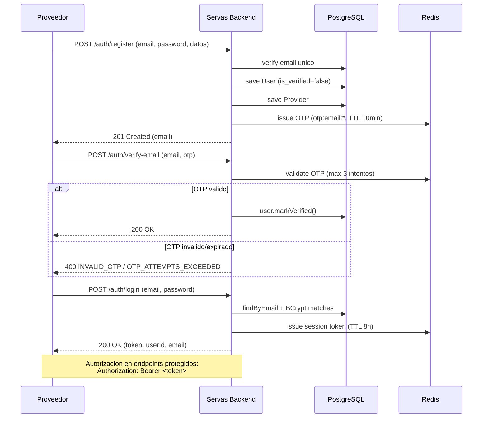
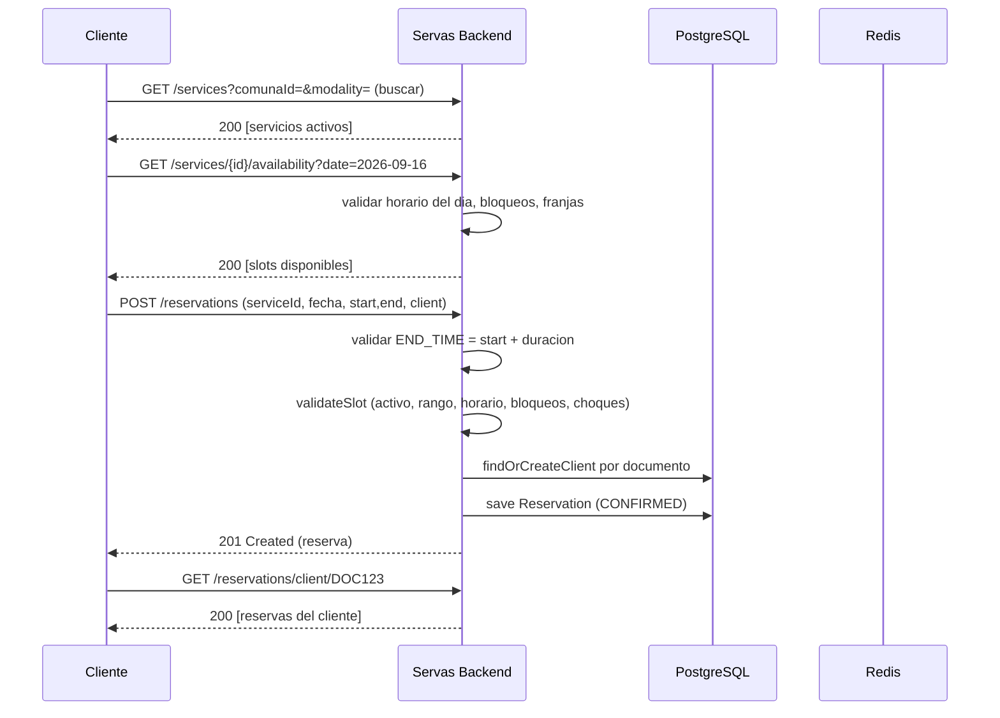
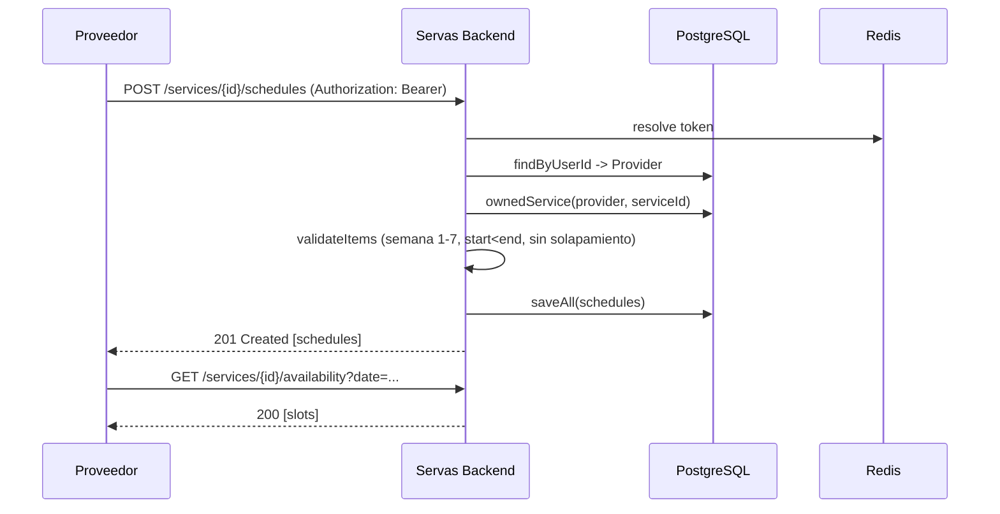
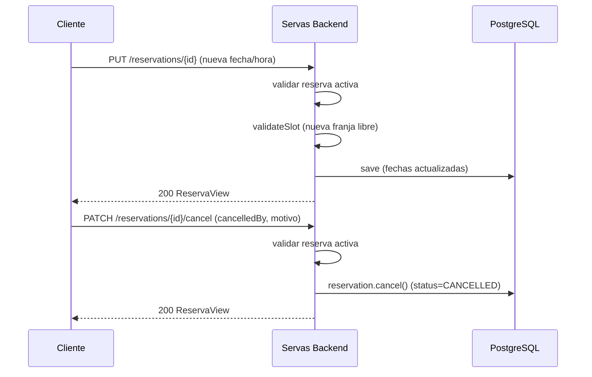

# Casos de Uso — Servas Backend

## 1. Actores involucrados

| Actor                 | Descripcion                                                                                                                            | Autenticacion                                                                    |
|-----------------------|----------------------------------------------------------------------------------------------------------------------------------------|----------------------------------------------------------------------------------|
| **Cliente final**     | Persona que busca servicios y reserva citas. No necesita cuenta. Se identifica por su numero de documento.                             | Sin autenticacion                                                                |
| **Proveedor**         | Prestador de servicios (empresa) que gestiona su oferta, horarios y agenda. Se registra con email/password y debe verificar su correo. | Token de sesion (header `Authorization: Bearer <token>`, 8h expiracion en Redis) |
| **Sistema (interno)** | Redis (sesiones/OTP), PostgreSQL, generador de UUID. No es un actor externo; se documenta como soporte.                                | —                                                                                |

## 2. Mapa de casos de uso

```mermaid
flowchart LR
    subgraph Cliente["Cliente final"]
        C1[UC-01 Buscar servicios]
        C2[UC-02 Ver detalle de servicio]
        C3[UC-03 Consultar comunas]
        C4[UC-04 Consultar disponibilidad]
        C5[UC-05 Crear reserva]
        C6[UC-06 Ver reservas por documento]
        C7[UC-07 Ver detalle reserva]
        C8[UC-08 Modificar reserva]
        C9[UC-09 Cancelar reserva]
    end

    subgraph Proveedor["Proveedor"]
        P1[UC-10 Registrarse]
        P2[UC-11 Verificar email OTP]
        P3[UC-12 Reenviar OTP]
        P4[UC-13 Iniciar sesion]
        P5[UC-14 Cerrar sesion]
        P15[UC-15 Recuperar password]
        P6[UC-16 Crear empresa]
        P7[UC-17 Actualizar empresa]
        P8[UC-18 Crear servicio]
        P9[UC-19 Actualizar servicio]
        P10[UC-20 Activar/desactivar servicio]
        P11[UC-21 Configurar horarios]
        P12[UC-22 Reemplazar horarios]
        P13[UC-23 Bloquear fechas]
        P14[UC-24 Ver agenda]
        P16[UC-25 Reporte de reservas]
        P17[UC-26 Reporte de ocupacion]
        P18[UC-27 Reporte de demanda]
    end

    GC[Servas Backend]
    Cliente --> GC
    Proveedor --> GC
```

## 3. Casos de uso funcionales

### 3.1 Cliente final

| #     | Caso de uso                | Endpoint                                          | Descripcion                                                                                                                                          |
|-------|----------------------------|---------------------------------------------------|------------------------------------------------------------------------------------------------------------------------------------------------------|
| UC-01 | Buscar servicios           | `GET /services`                                   | Lista servicios activos. Filtros opcionales: `companyId`, `comunaId`, `modality`.                                                                    |
| UC-02 | Ver detalle de servicio    | `GET /services/{id}`                              | Detalle completo de un servicio (empresa, comuna, costos, horario...).                                                                               |
| UC-03 | Consultar comunas          | `GET /comunas`                                    | Lista de comunas disponibles.                                                                                                                        |
| UC-04 | Consultar disponibilidad   | `GET /services/{id}/availability?date=YYYY-MM-DD` | Franjas horarias disponibles para una fecha (respeta horarios, bloqueos, rango de atencion).                                                         |
| UC-05 | Crear reserva              | `POST /reservations`                              | Reserva una franja. El cliente se crea/recupera por documento. Valida: servicio activo, fecha en rango, dentro de horario, no bloqueada, sin choque. |
| UC-06 | Ver reservas por documento | `GET /reservations/client/{documentNumber}`       | Lista de reservas del cliente ordenadas por fecha desc.                                                                                              |
| UC-07 | Ver detalle de reserva     | `GET /reservations/{id}`                          | Detalle de una reserva (servicio, cliente, fecha, estado, cancelacion).                                                                              |
| UC-08 | Modificar reserva          | `PUT /reservations/{id}`                          | Cambia fecha/hora de una reserva activa (PENDING o CONFIRMED) validando disponibilidad.                                                              |
| UC-09 | Cancelar reserva           | `PATCH /reservations/{id}/cancel`                 | Cancela una reserva activa indicando `cancelledBy` (CLIENT/proveedor) y motivo.                                                                      |

### 3.2 Proveedor

| #     | Caso de uso          | Endpoint                         | Descripcion                                                                                                  |
|-------|----------------------|----------------------------------|--------------------------------------------------------------------------------------------------------------|
| UC-10 | Registrarse          | `POST /auth/register`            | Crea usuario + proveedor. Se genera OTP para verificar el email.                                             |
| UC-11 | Verificar email      | `POST /auth/verify-email`        | Valida el OTP (6 digitos, TTL 10 min, max 3 intentos) y marca el usuario como verificado.                    |
| UC-12 | Reenviar OTP         | `POST /auth/verify-email/resend` | Genera un nuevo OTP para el email.                                                                           |
| UC-13 | Iniciar sesion       | `POST /auth/login`               | Valida credenciales; si el email no esta verificado devuelve `EMAIL_NOT_VERIFIED`. Devuelve token de sesion. |
| UC-14 | Cerrar sesion        | `POST /auth/logout`              | Revoca el token en Redis.                                                                                    |
| UC-15 | Recuperar password   | `POST /auth/forgot-password`     | Reusa `resendVerification`: emite nuevo OTP (el OTP sirve de recuperacion).                                  |
| UC-16 | Crear empresa        | `POST /companies`                | Crea empresa para el proveedor autenticado. NIT unico. Multipart.                                            |
| UC-17 | Actualizar empresa   | `PUT /companies/{id}`            | Actualiza datos de la empresa (solo el dueno). Multipart, campos parciales.                                  |
| UC-18 | Crear servicio       | `POST /services`                 | Crea servicio en una empresa del proveedor. Presencial requiere comuna.                                      |
| UC-19 | Actualizar servicio  | `PUT /services/{id}`             | Actualiza datos del servicio (solo dueno).                                                                   |
| UC-20 | Activar/desactivar   | `PATCH /services/{id}/status`    | Cambia `isActive` del servicio.                                                                              |
| UC-21 | Configurar horarios  | `POST /services/{id}/schedules`  | Define los horarios semanales (dia 1-7, hora inicio/fin). Valida solapamientos y estructura.                 |
| UC-22 | Reemplazar horarios  | `PUT /services/{id}/schedules`   | Reemplaza todos los horarios del servicio.                                                                   |
| UC-23 | Bloquear fechas      | `POST /blocked-dates`            | Bloquea una fecha (por empresa y/o servicio especifico).                                                     |
| UC-24 | Ver agenda           | `GET /provider/reservations`     | Reservas del proveedor con filtros opcionales `status` y `date`.                                             |
| UC-25 | Reporte de reservas  | `GET /reports/reservations`      | Total y desglose por estado.                                                                                 |
| UC-26 | Reporte de ocupacion | `GET /reports/occupancy`         | Ocupacion % por servicio (reservas activas vs capacidad semanal) y promedio global.                          |
| UC-27 | Reporte de demanda   | `GET /reports/demand`            | Top 10 servicios con mas reservas.                                                                           |

## 4. Diagramas de secuencia

### 4.1 Registro, verificación y login del proveedor

### 4.2 Crear una reserva

### 4.3 Configurar horarios del servicio (proveedor)

### 4.4 Modificar y cancelar reserva

## 5. Reglas de negocio relevantes (para pruebas)

1. **Autenticación**: email se normaliza a minúsculas; password se guarda con BCrypt.
2. **Verificación**: un proveedor no puede hacer login si `is_verified=false`. 1 de cada 5 usuarios de demo no está
   verificado.
3. **OTP**: 6 dígitos, TTL 10 min, máximo 3 intentos fallidos (después se invalida el OTP).
4. **Sesión**: el token se almacena en Redis con TTL de 8 horas; el logout lo revoca.
5. **Reserva**:
    - `endTime` debe ser exactamente `startTime + durationMinutes` del servicio.
    - No se puede reservar en una franja fuera del horario de atención del día.
    - El servicio no atiende si no tiene horario para ese día de semana.
    - No se reserva fuera del rango `[startDate, endDate]` del servicio.
    - No se reserva en fechas bloqueadas (por empresa o por servicio).
    - No se reserva una franja ya ocupada (choques de horario).
    - Solo una reserva puede ser cancelada/modificada si esta PENDING o CONFIRMED.
6. **Horarios**: `dayOfWeek` entre 1 (lunes) y 7 (domingo); `start < end`; sin solapamientos el mismo día. Lista de
   horarios no vacía.
7. **Propiedad**: un proveedor solo puede gestionar sus propias empresas, servicios, horarios, bloqueos y ver su agenda.
8. **Servicio presencial** requiere `comunaId` y que la comuna exista.
9. **Cliente**: se identifica por `(documentType, documentNumber)`; si no existe se crea al reservar.